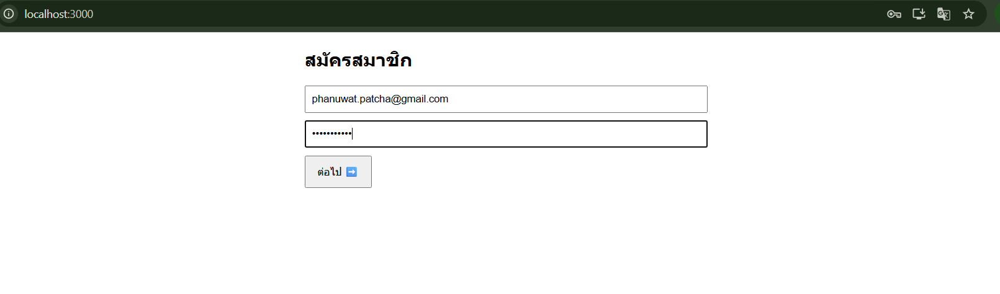
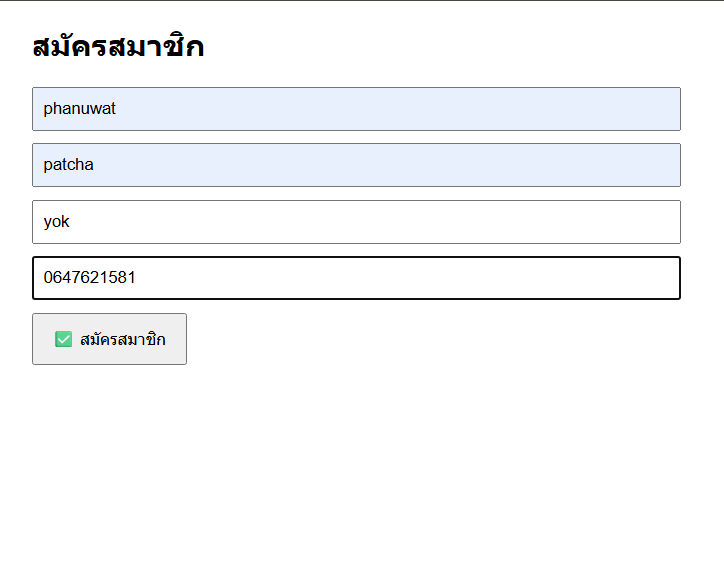
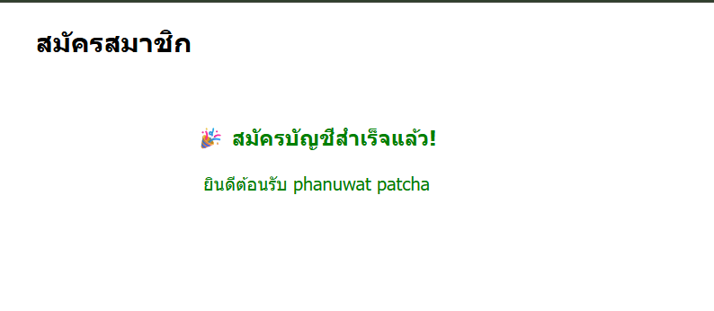
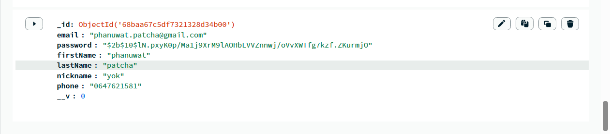

# login-system

ระบบล็อกอินพื้นฐานที่พัฒนาโดยใช้ Node.js, Express, MongoDB และ Frontend ด้วย HTML, CSS, และ JavaScript  
รองรับการสมัครสมาชิก, เข้าสู่ระบบ, และตรวจสอบ session ของผู้ใช้  

---

## Features
- สมัครสมาชิกด้วยอีเมลและรหัสผ่าน
- เข้าสู่ระบบ
- ตรวจสอบ session ของผู้ใช้
- จัดการ route และ middleware สำหรับความปลอดภัย

---

